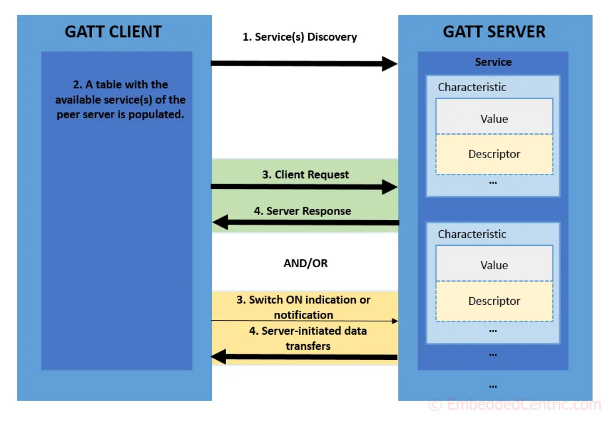

# BLE beacon header

## Header

|             |                   |                                                                               |
| ----------- | ----------------- | ----------------------------------------------------------------------------- |
| MSG         | 2                 | https://www.bluetooth.com/specifications/assigned-numbers/company-identifiers |
| Packet Flag | 2                 |                                                                               |
| Name        | 未定              |                                                                               |
| UUID        | 未定              | 16                                                                            |
| 任意データ  | 31byte の余った分 |                                                                               |
| TX pwr      | 2                 |                                                                               |

## Central filter

void filterRssi(int8_t min_rssi);
void filterMSD(uint16_t manuf_id);
void filterUuid(BLEUuid ble_uuid);

|            |                        |     |
| ---------- | ---------------------- | --- |
| filterRssi | 電波強度フィルター     |     |
| filterMSD  | 使用するため登録は必要 |     |
| filterUuid | デバイス認識           |     |

- デバイスを見分けるが必要ため、UUID は必須。Beacon の残りスペースは 3byte しかない
- ScanResponse を使う場合+29byte 使用可能

## Boardcast test

5/21 17:xx ~ 5/24 9:42

| 送信   | 受信   | avg(ms) | min(ms) | max(ms) |
| ------ | ------ | ------- | ------- | ------- |
| 234872 | 234870 | 1002    | 998     | 1007    |

## Gatt service

https://embeddedcentric.com/lesson-2-ble-profiles-services-characteristics-device-roles-and-network-topology/

- Client/Server が逆
- 接続中にデータの変更があった時のみ Client がデータを読みに行く
